# 问题三：可解释性多模态情感预测

## 1 问题分析与建模目标

问题三要求在三模态信息完整的条件下，同时输出情感极性、情感强度以及能够回溯到原始素材的解释证据。模型不仅要回答“样本属于哪一类、强度是多少”，还要回答“文本、语音和视觉分别起到了多大作用，以及哪一段信息改变了当前判断”。因此，本问题被建模为一个带有后验反事实解释的多任务学习问题。

三模态具有不同的特征维度、时间组织方式和有效长度。直接拼接可能造成高维文本特征主导训练，也可能使填充位置参与注意力计算。另一方面，模型内部的注意力和门控值只反映表征交互或融合状态，不能单独证明某个片段真正影响了最终输出。本文据此采用如下路线：先在训练集边界内完成标准化，再进行掩码感知的模态内时序编码；以文本为查询完成音频和视觉交互；通过动态门控获得样本级融合表示；利用分类头和回归头联合预测；最后固定模型参数，以训练集均值为反事实基线，执行模态级和局部窗口级遮挡，生成贡献度、证据映射、关键帧和解释卡。

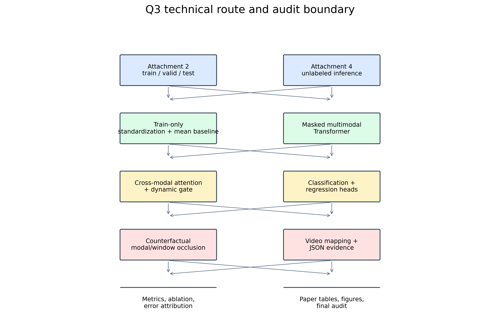{#fig:route width=0.95\linewidth}

图 1 展示了从特征输入到证据输出的完整流程。图中预测主干和解释分支共享同一个最佳模型，解释阶段不再更新模型参数，也不使用附件四选择超参数。

## 2 模型假设与符号定义

### 2.1 模型假设

（1）每个样本的文本、语音和视觉信息均可表示为保序时序序列，序列位置的相对关系包含情感表达信息。

（2）特征文件提供的有效掩码能够区分有效观测、填充位置和无效位置；掩码同时作用于自注意力、跨模态注意力和池化。

（3）预处理统计量只由训练集估计，验证集、测试集和附件四复用训练集统计量。

（4）情感极性和强度共享多模态语义表示，但使用独立输出头，因为分类边界和连续强度并不等价。

（5）遮挡模态或局部窗口后产生的预测变化表示模型敏感性，不等同于真实情感成因或人类心理因果关系。

（6）对齐特征的相同序号表示相对对齐窗口，不保证逐词、逐帧的真实时间戳；文本证据因而只报告对齐相对窗口。

### 2.2 符号定义

| 符号 | 含义 |
|---|---|
| $i$ | 样本编号，$i=1,\ldots,N$ |
| $m\in\{T,A,V\}$ | 文本、音频、视觉模态 |
| $X_i^{(m)}$ | 模态 $m$ 的输入序列 |
| $M_i^{(m)}$ | 模态 $m$ 的有效位置掩码 |
| $d_m$ | 模态 $m$ 的输入维度 |
| $d$ | 统一隐空间维数，取 64 |
| $H_i^{(m)}$ | 模态内 Transformer 编码结果 |
| $g_i^{(m)}$ | 模态摘要向量 |
| $G_{i,m}$ | 交互增强后的模态摘要 |
| $\alpha_i^{(m)}$ | 动态门控值 |
| $p_i$ | 三分类概率向量 |
| $\hat y_i$ | 情感强度预测值 |
| $c_{i,m}$ | 反事实模态贡献 |
| $r_{i,m,k}^{local}$ | 第 $k$ 个局部窗口的敏感性 |

## 3 数据边界与输入输出

### 3.1 数据组织

本文固定使用对齐特征版本 `aligned_50.pkl`。每个模态序列表示为

$$
X_i^{(m)}=(x_{i,1}^{(m)},\ldots,x_{i,L_m}^{(m)}),\quad m\in\{T,A,V\},
\tag{1}
$$

有效掩码为

$$
M_i^{(m)}=(m_{i,1}^{(m)},\ldots,m_{i,L_m}^{(m)}),\quad m_{i,t}^{(m)}\in\{0,1\}.
\tag{2}
$$

当前文本、语音和视觉特征维度分别为 768、74 和 35，对齐序列长度为 50。分类标签映射为 0：Negative、1：Neutral、2：Positive；回归标签范围为 $[-3,3]$。本次运行的特征 SHA-256 为 `66e867aa74bc70a844e806e5571e371c9abb4a35f9e2887ce9b4d97ff2cb8fcd`。

### 3.2 数据边界

附件二 train、valid、test 样本数分别为 3395、728 和 727。训练集只用于拟合模型与标准化统计量；验证集用于选择模型和解释参数；测试集仅用于最终有标签评价。附件四有 20 个无标签样本，只进行固定模型推理和解释生成，不参与训练、调参、早停、阈值选择或性能统计。

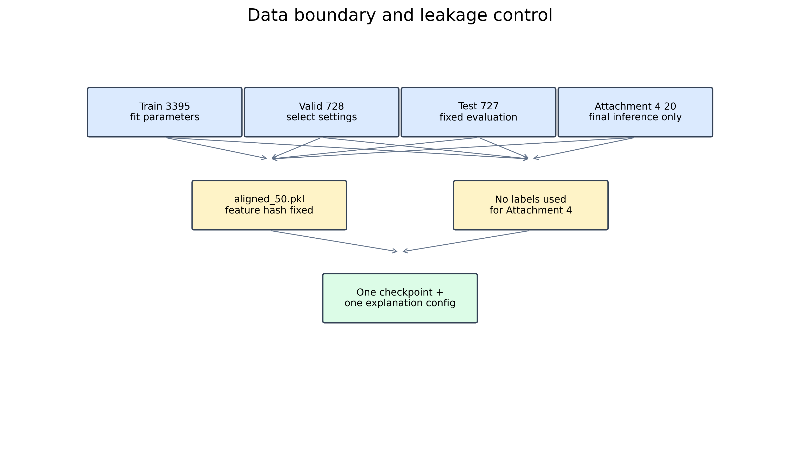{#fig:boundary width=0.82\linewidth}

图 2 给出数据边界。该边界是本文所有实验结果可解释性的前提：附件四预测不能写成 Accuracy、F1、MAE 或 Pearson。

### 3.3 输入输出定义

模型输入为三模态特征、三模态有效掩码、数据划分和样本主键。模型输出包括分类概率、预测类别、情感强度、门控值；解释模块进一步输出模态敏感性、归一化贡献、主要模态、局部窗口起止位置、相对时间、帧索引和映射状态。`predictions_valid.csv`、`predictions_test.csv` 和 `predictions_attachment4.csv` 保存预测结果；`local_importance_*.csv` 保存局部遮挡影响；`evidence_mapping_*.csv` 保存证据回溯字段。

## 4 多模态预测模型

### 4.1 标准化与模态投影

设训练集统计量为 $\mu_m$ 和 $\sigma_m$，仅对有效位置计算，则标准化为

$$
\widetilde{x}_{i,t}^{(m)}=\frac{x_{i,t}^{(m)}-\mu_m}{\max(\sigma_m,\varepsilon)}.
\tag{3}
$$

随后使用模态专属投影映射到统一隐空间：

$$
e_{i,t}^{(m)}=\operatorname{LN}(W_m\widetilde{x}_{i,t}^{(m)}+b_m),\quad e_{i,t}^{(m)}\in\mathbb R^{64}.
\tag{4}
$$

验证集、测试集和附件四均复用 `train_standardizer.npz`，不重新估计均值和方差。

### 4.2 掩码感知时序编码

加入可学习位置表示 $p_t$ 后，对每个模态使用独立 Transformer 编码器：

$$
\bar e_{i,t}^{(m)}=e_{i,t}^{(m)}+p_t,
\qquad H_i^{(m)}=\operatorname{Encoder}_m(\bar E_i^{(m)},M_i^{(m)}).
\tag{5}
$$

无效键位置在注意力中被屏蔽。编码结果采用掩码平均池化：

$$
g_i^{(m)}=\frac{\sum_{t=1}^{L_m}m_{i,t}^{(m)}H_{i,t}^{(m)}}{\max(1,\sum_{t=1}^{L_m}m_{i,t}^{(m)})}.
\tag{6}
$$

该处理保证 padding 不会被当作情感信息，并支持局部模态缺失。

### 4.3 文本引导的跨模态交互

以文本序列为查询，分别从音频和视觉中提取补充信息：

$$
R_i^{T\leftarrow A}=\operatorname{MHA}(H_i^{(T)},H_i^{(A)},H_i^{(A)};M_i^{(A)}),
\tag{7}
$$

$$
R_i^{T\leftarrow V}=\operatorname{MHA}(H_i^{(T)},H_i^{(V)},H_i^{(V)};M_i^{(V)}).
\tag{8}
$$

源码中两类跨模态响应按照文本有效位置池化后加到文本摘要，再与音频、视觉摘要组成门控输入：

$$
\widetilde g_i^{(T)}=g_i^{(T)}+\operatorname{Pool}(R_i^{T\leftarrow A})+\operatorname{Pool}(R_i^{T\leftarrow V}),
\quad G_i=[\widetilde g_i^{(T)};g_i^{(A)};g_i^{(V)}]^{\mathsf T}.
\tag{9}
$$

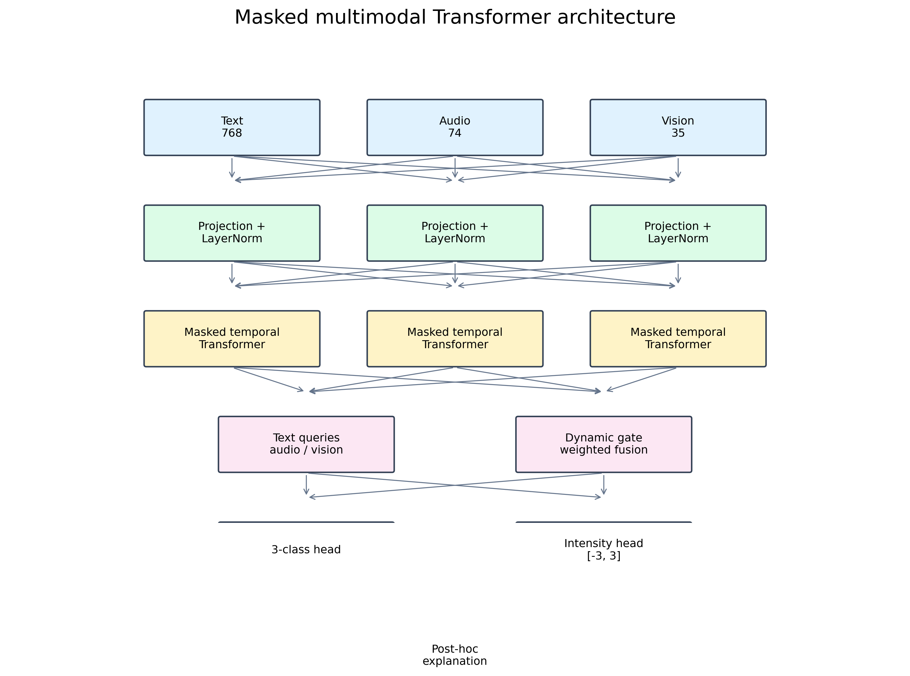{#fig:architecture width=0.95\linewidth}

图 3 展示实际模型结构。跨模态注意力用于表征增强，不直接作为最终解释。

### 4.4 动态门控与双任务输出

对每个样本和模态计算门控分数：

$$
a_i^{(m)}=w^{\mathsf T}G_{i,m}+b,qquad
\alpha_i^{(m)}=\frac{q_i^{(m)}e^{a_i^{(m)}}}{\sum_rq_i^{(r)}e^{a_i^{(r)}}+\varepsilon},
\tag{10}
$$

其中 $q_i^{(m)}$ 表示模态是否存在有效观测。融合表示为

$$
z_i=\operatorname{MLP}\left(\sum_{m\in\{T,A,V\}}\alpha_i^{(m)}G_{i,m}\right).
\tag{11}
$$

分类概率和回归输出分别为

$$
p_i=\operatorname{softmax}(W_{cls}z_i+b_{cls}),
\tag{12}
$$

$$
\hat y_i=3\tanh(w_{reg}^{\mathsf T}z_i+b_{reg}).
\tag{13}
$$

联合目标函数为

$$
\mathcal L=\lambda_{cls}\mathcal L_{CE}+\lambda_{reg}\mathcal L_{SmoothL1},\qquad \lambda_{cls}=\lambda_{reg}=1.
\tag{14}
$$

## 5 反事实解释模型

### 5.1 模态贡献

固定预测模型后，对模态 $m$ 使用训练集均值基线进行替换，得到 $(p_i^{-m},\hat y_i^{-m})$。分类和回归变化分别为

$$
\Delta_{i,m}^{cls}=D_{KL}(p_i\Vert p_i^{-m}),\qquad \Delta_{i,m}^{reg}=|\hat y_i-\hat y_i^{-m}|.
\tag{15}
$$

在验证集预先固定尺度后定义综合敏感性 $r_{i,m}$，并归一化为

$$
c_{i,m}=\frac{\max(r_{i,m},0)}{\sum_{r\in\{T,A,V\}}\max(r_{i,r},0)+\varepsilon}.
\tag{16}
$$

$c_{i,m}$ 之和约为 1，最大值对应主要模态。该值是模型后验敏感性，不是因果真值。

### 5.2 局部证据与忠实性

局部窗口长度和步长均为 7。对窗口内特征执行基线替换，计算

$$
r_{i,m,k}^{local}=\rho D_{KL}(p_i\Vert p_i^{-m,k})+(1-\rho)|\hat y_i-\hat y_i^{-m,k}|.
\tag{17}
$$

每个样本保留 Top-3 窗口。验证集 728 个样本中，高重要性窗口平均影响为 0.0748529，低重要性窗口为 0.0032877，差值为 0.0715652，比例为 22.7675。该结果支持窗口排序具有模型敏感性区分能力。

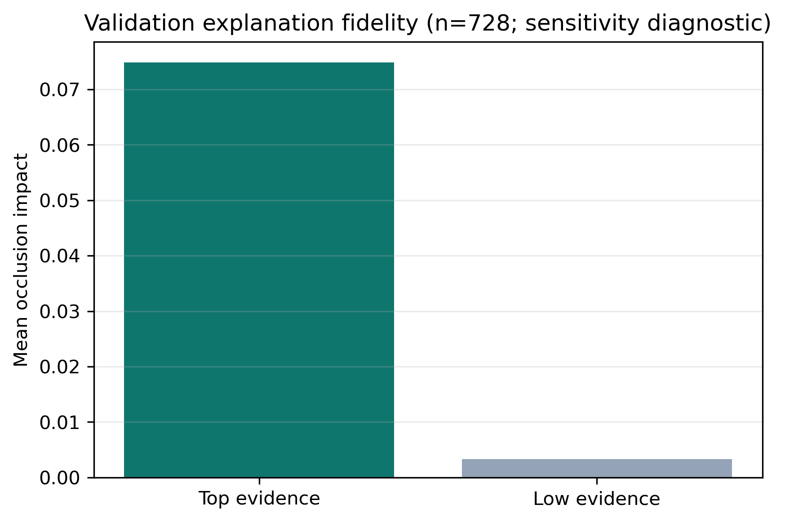{#fig:fidelity width=0.78\linewidth}

图 4 是验证集忠实性诊断；它验证的是遮挡排序与模型输出变化的一致性，不是人工证据准确率。

## 6 实验设置与评价指标

### 6.1 实验配置

| 参数 | 实际设置 |
|---|---|
| 特征版本 | aligned_50，长度 50 |
| 输入维度 | 768 / 74 / 35 |
| 隐空间、层数、头数 | 64 / 1 / 4 |
| Dropout | 0.1 |
| Batch size、Epoch | 64 / 50 |
| 学习率、权重衰减 | $2\times10^{-5}$ / $1\times10^{-4}$ |
| 随机种子、设备 | 20260924 / CUDA |
| 解释基线 | train_mean，标准化训练特征空间 |
| 窗口、步长、Top-K | 7 / 7 / 3 |

训练曲线来自 `training_curve.csv`，模型在第 29 个 epoch 获得最低验证损失 1.1744457，最终保留该最佳 epoch 对应权重。

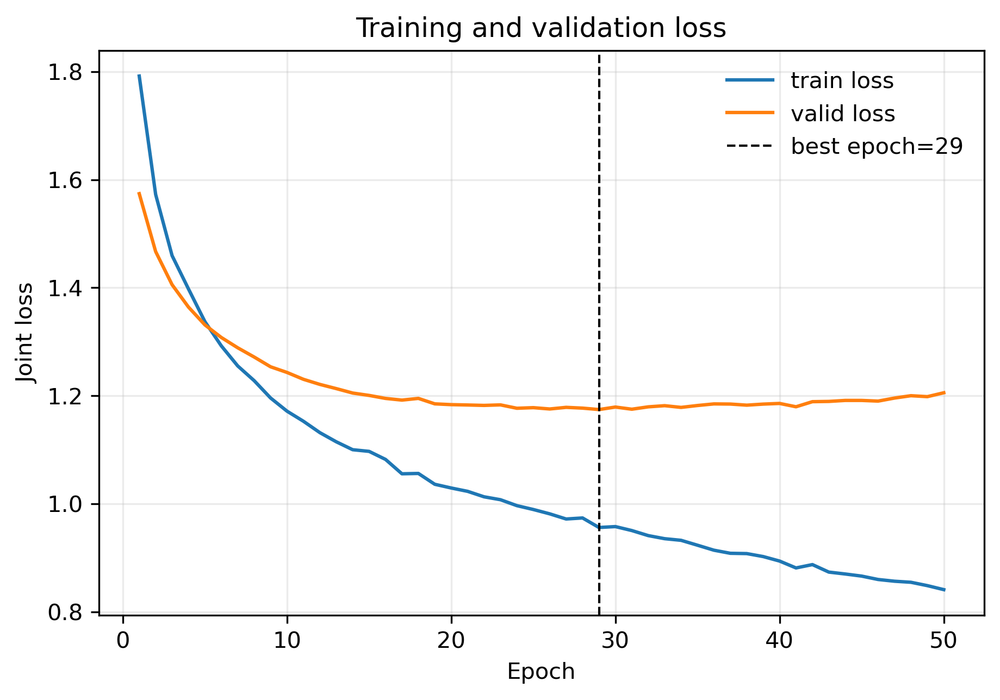{#fig:training width=0.82\linewidth}

图 5 与训练日志共同表明，训练损失从第 1 个 epoch 的 1.7918299 降至第 50 个 epoch 的 0.8410989；验证损失在第 29 个 epoch 达到 1.1744457，之后未继续改善，模型选择遵循验证集而非测试集。

### 6.2 评价指标

分类采用 Accuracy 与 Macro-F1，回归采用 MAE 与 Pearson：

$$
Accuracy=\frac{1}{N}\sum_i\mathbf 1(\hat c_i=c_i),\qquad Macro\text{-}F1=\frac{1}{3}\sum_{c=0}^2F1_c.
\tag{18}
$$

$$
MAE=\frac{1}{N}\sum_i|\hat y_i-y_i|,
\tag{19}
$$

$$
Pearson=\frac{\sum_i(\hat y_i-\bar{\hat y})(y_i-\bar y)}{\sqrt{\sum_i(\hat y_i-\bar{\hat y})^2}\sqrt{\sum_i(y_i-\bar y)^2}}.
\tag{20}
$$

## 7 有标签实验结果

### 7.1 总体性能

表 1 直接对应 `model_metrics.csv`。

**表 1  双任务模型总体性能**

| 划分 | Accuracy | Macro-F1 | MAE | Pearson |
|---|---:|---:|---:|---:|
| valid（728） | 0.607143 | 0.547565 | 0.652097 | 0.580993 |
| test（727） | 0.672627 | 0.595023 | 0.679413 | 0.625911 |

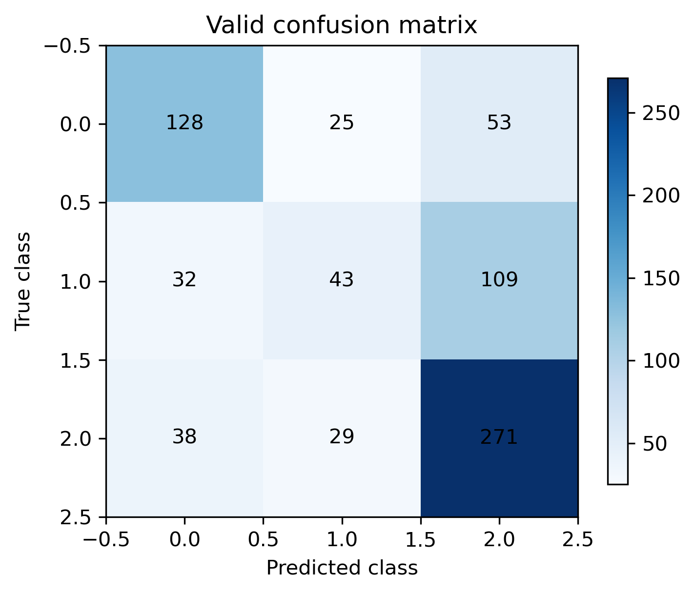{#fig:cmvalid width=0.68\linewidth}

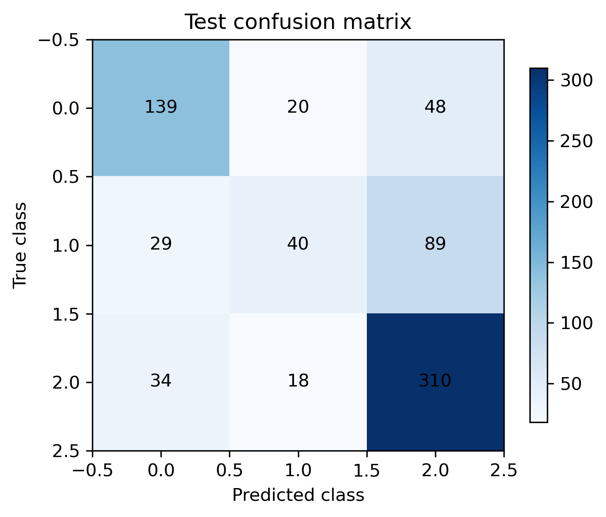{#fig:cmtest width=0.68\linewidth}

图 6 和图 7 展示分类混淆结构。test Accuracy 为 0.672627、Macro-F1 为 0.595023；回归 MAE 为 0.679413，Pearson 为 0.625911。当前只使用一个随机种子，因此不报告显著性或多种子置信区间。

### 7.2 类别级结果

**表 2  验证集分类报告**

| 类别 | Precision | Recall | F1 | Support |
|---|---:|---:|---:|---:|
| Negative | 0.6465 | 0.6214 | 0.6337 | 206 |
| Neutral | 0.4433 | 0.2337 | 0.3060 | 184 |
| Positive | 0.6259 | 0.8018 | 0.7030 | 338 |

表 2 来自 `classification_report_valid.csv`。Positive 类召回率最高，而 Neutral 类召回率仅为 0.2337，说明中性样本容易被划入相邻极性类别。该现象仅作为当前运行的误差结构，不在缺少重训练对照的条件下归因于某个单一机制。

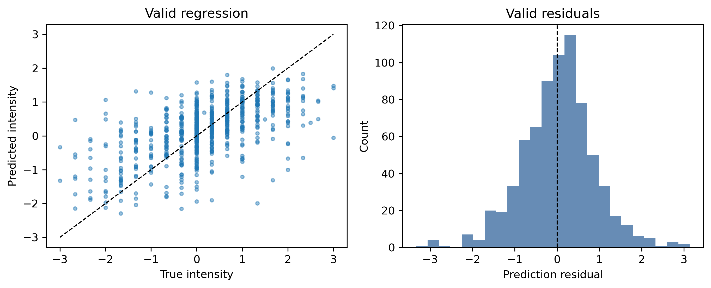{#fig:regvalid width=0.83\linewidth}

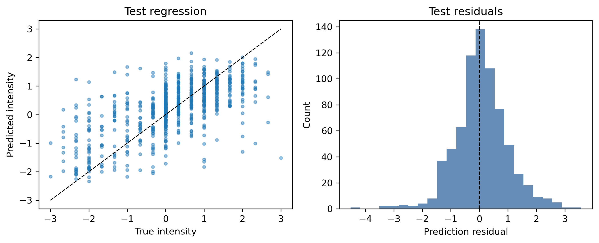{#fig:regtest width=0.83\linewidth}

图 8 和图 9 是实际生成的回归诊断图，用于观察连续强度的预测偏差与离散程度，不能替代表 1 的 MAE 和 Pearson。

## 8 模态贡献与后验诊断

### 8.1 全局模态贡献

**表 3  反事实模态贡献统计**

| 划分 | 模态 | 样本数 | 平均贡献 | 标准差 | 中位数 |
|---|---|---:|---:|---:|---:|
| valid | text | 728 | 0.564601 | 0.207986 | 0.583357 |
| valid | audio | 728 | 0.241857 | 0.153316 | 0.225415 |
| valid | vision | 728 | 0.193542 | 0.126525 | 0.178919 |
| test | text | 727 | 0.571946 | 0.207630 | 0.596444 |
| test | audio | 727 | 0.245046 | 0.152818 | 0.225407 |
| test | vision | 727 | 0.183009 | 0.128257 | 0.167823 |
| attachment4 | text | 20 | 0.641696 | 0.186134 | 0.716467 |
| attachment4 | audio | 20 | 0.197818 | 0.136718 | 0.166865 |
| attachment4 | vision | 20 | 0.160485 | 0.115804 | 0.142188 |

表 3 来自 `modality_contribution_summary.csv`；附件四三行是 20 个无标签样本的模态贡献统计，原始样本记录在 `predictions_attachment4.csv`。有标签数据中，文本平均贡献约 0.565--0.572，音频约 0.242--0.245，视觉约 0.183--0.194。该结果表示当前模型对文本输入更敏感，不表示文本在真实情感形成中必然最重要。

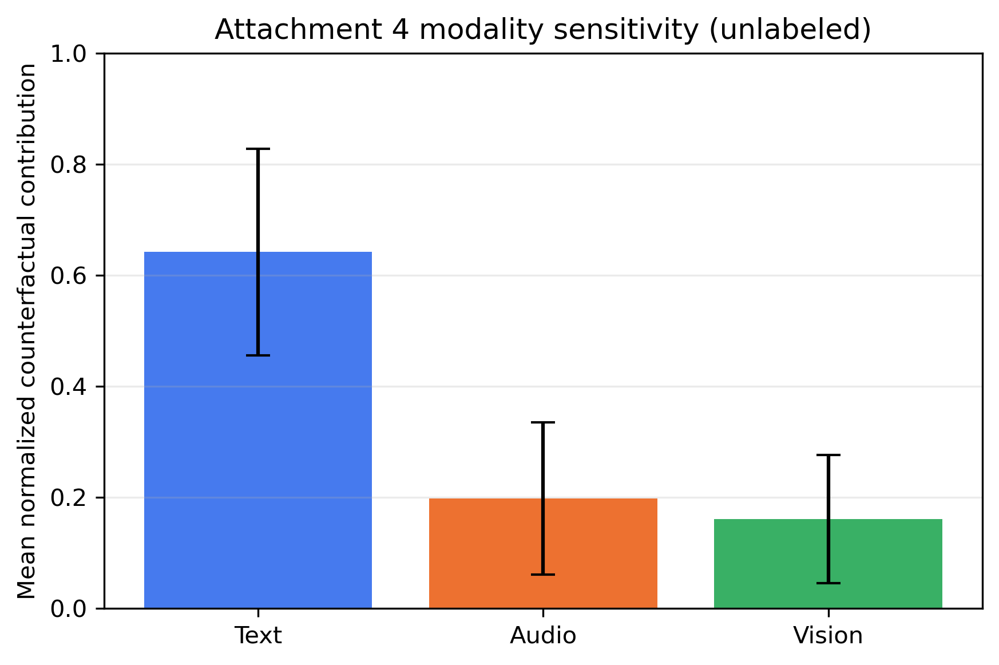{#fig:global width=0.82\linewidth}

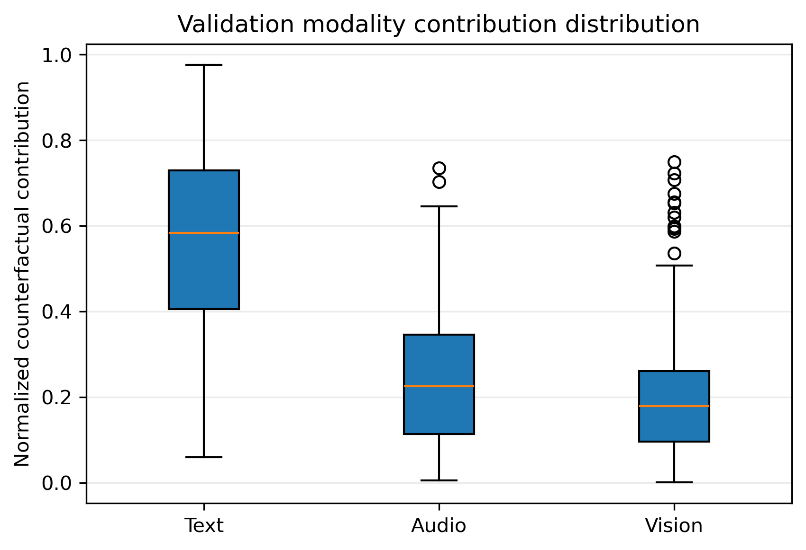{#fig:modalvalid width=0.82\linewidth}

图 10 和图 11 分别展示全局贡献及验证集贡献分布。三类贡献均来自遮挡后输出变化，而不是直接读取门控值。

### 8.2 模态移除诊断

**表 4  固定模型的后验模态移除结果**

| 划分 | 移除模态 | Accuracy | Macro-F1 | MAE | Pearson |
|---|---|---:|---:|---:|---:|
| valid | none | 0.607143 | 0.547565 | 0.652097 | 0.580993 |
| valid | text | 0.287088 | 0.263764 | 0.869413 | -0.020699 |
| valid | audio | 0.604396 | 0.571687 | 0.716655 | 0.579688 |
| valid | vision | 0.629121 | 0.576199 | 0.694256 | 0.573931 |
| test | none | 0.672627 | 0.595023 | 0.679413 | 0.625911 |
| test | text | 0.288858 | 0.266980 | 0.989222 | -0.064822 |
| test | audio | 0.678129 | 0.625366 | 0.733368 | 0.638242 |
| test | vision | 0.672627 | 0.592638 | 0.725985 | 0.613138 |

表 4 直接来自 `modality_ablation_metrics.csv`，是固定模型的后验模态移除诊断，不是重新训练的单模态基线。移除文本后 valid Accuracy 降至 0.287088、test Accuracy 降至 0.288858，且 Pearson 分别降至 -0.020699 和 -0.064822，说明模型预测对文本输入高度敏感；音频、视觉移除后的分类变化较小，但回归误差上升，说明二者仍可能提供补充强度信息。

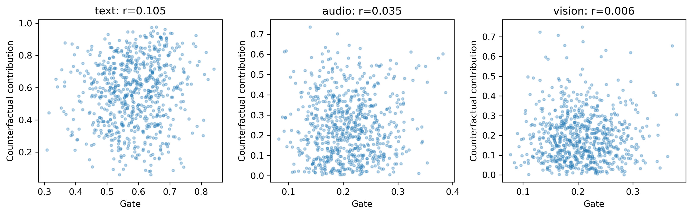{#fig:gate width=0.86\linewidth}

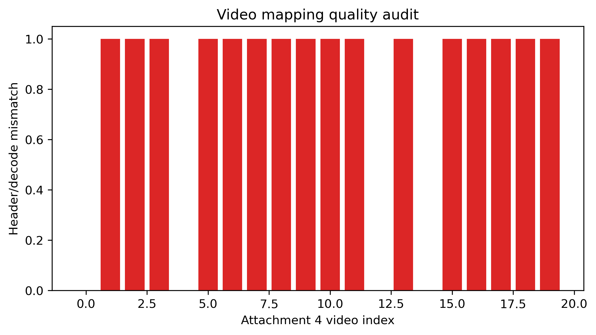{#fig:mapping width=0.78\linewidth}

图 12 展示门控值与反事实贡献的关系。`gate_contribution_consistency.csv` 给出的 Pearson 相关系数为 text 0.1050、audio 0.0349、vision 0.0061，相关性较弱，进一步说明门控值不能替代反事实贡献。图 13 展示映射质量统计，所有附件四证据行均完成边界检查，未发生证据行被截断。

## 9 局部证据、关键帧与附件四结果

### 9.1 局部重要性

`local_importance_valid.csv`、`local_importance_test.csv` 和 `local_importance_attachment4.csv` 分别保存三种划分的窗口影响；图 14--16 展示相应热力图。valid 和 test 热力图可结合真实标签分析证据与误差，附件四热力图只用于推理证据展示。

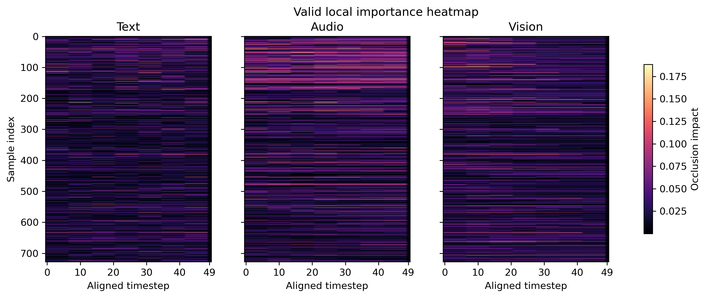{#fig:localvalid width=0.9\linewidth}

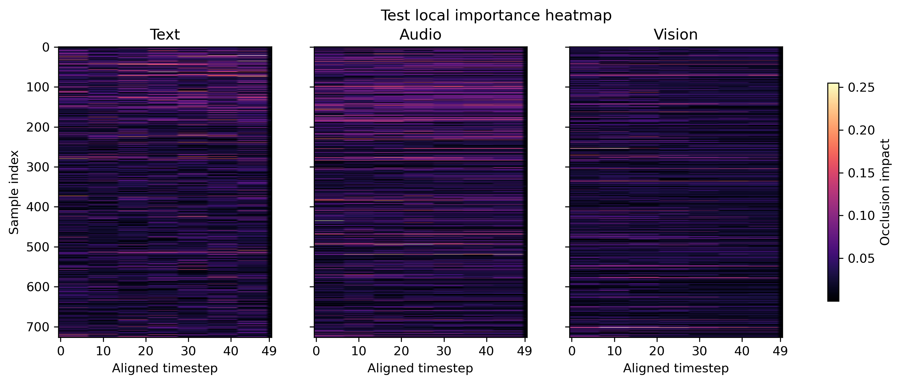{#fig:localtest width=0.9\linewidth}

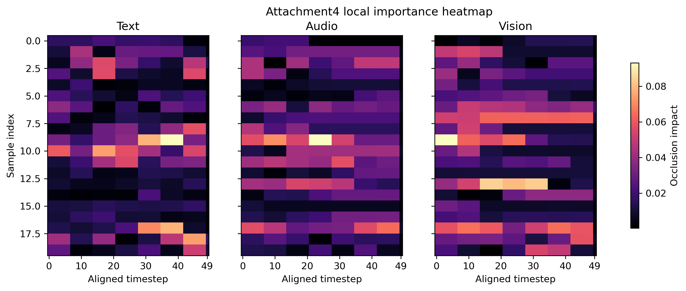{#fig:locala4 width=0.9\linewidth}

图 14--16 的横轴是对齐窗口位置，纵轴是样本，颜色表示反事实遮挡影响。它们提供的是可回溯的模型证据排序，不应被表述为逐词情感原因。

### 9.2 代表性样本

**表 5  代表性验证样本**

| 类型 | sample_id | 真实/预测类别 | 真实/预测强度 | 主要模态 | 文本/音频/视觉贡献 |
|---|---|---|---|---|---|
| 文本主导 | `jICmfLeFymA$_$16` | 2 / 2 | 1.667 / 1.029 | text | 0.976 / 0.005 / 0.018 |
| 音频主导 | `PboaYD5hlG8$_$8` | 0 / 2 | -1.333 / 0.338 | audio | 0.167 / 0.735 / 0.098 |
| 视觉主导 | `wosolsrH3sM$_$6` | 2 / 0 | 0.333 / -0.763 | vision | 0.092 / 0.159 / 0.749 |
| 分类错误 | `0utROiKxejc$_$1` | 1 / 2 | 0 / -0.016 | text | 0.582 / 0.206 / 0.212 |
| 回归误差最大 | `252998$_$7` | 2 / 0 | 1.333 / -1.996 | text | 0.603 / 0.061 / 0.337 |
| 贡献均衡 | `TYJzg5IJN8o$_$11` | 0 / 2 | -0.333 / 0.380 | audio | 0.335 / 0.345 / 0.320 |

表 5 来自 `representative_sample_selection.csv`。其中音频主导和视觉主导样本均出现分类错误，说明主要模态是模型的依赖来源而不是正确性保证；该表因此同时承担解释案例和失败案例的作用。

### 9.3 附件四最终推理

附件四预测结果保存在 `predictions_attachment4.csv`，20 条样本均生成类别、强度、门控、模态贡献、Top-3 证据影响和解释配置。代表性输出如下：样本 01 预测 Positive、强度 0.6411、主要模态 text；样本 02 预测 Negative、强度 -0.0867、主要模态 audio；样本 18 预测 Positive、强度 -1.0973、主要模态 vision；样本 16 预测 Negative、强度 -2.6106、主要模态 text。类别和连续强度是两个输出，不能仅根据类别推断强度符号。

**表 6  附件四代表性证据**

| 样本 | 预测类别 | 强度 | 主要模态 | Top-1 证据区间（秒） | 影响 |
|---|---|---:|---|---|---:|
| 01 | Positive | 0.6411 | text | 2.520--3.780 | 0.0478 |
| 02 | Negative | -0.0867 | audio | 0.471--0.943 | 0.0974 |
| 09 | Negative | -1.9809 | text | 4.228--4.933 | 0.1281 |
| 16 | Negative | -2.6106 | text | 2.604--3.038 | 0.0362 |
| 18 | Positive | -1.0973 | vision | 13.090--15.708 | 0.1737 |

表 6 取自 `table_evidence_examples.csv`；完整 20 条记录和证据文本在 `evidence_mapping_attachment4.csv` 中。每个样本均有一张解释卡和三个以内的模态关键帧，`keyframes.json` 与 `evidence_cards.json` 用文件名记录了元数据对应关系。

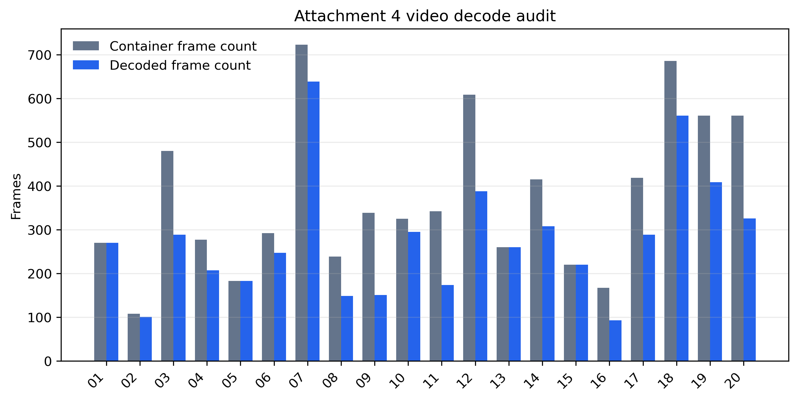{#fig:decode width=0.84\linewidth}

图 17 是视频解码审计。20 个视频均能完成解码，但 16 个视频的容器声明帧数与实际解码帧数不一致；因此证据边界以实际解码帧数为准，并在审计文件中保留该异常。

## 10 论文支撑材料与可复现性

当前结果包中的图、表、数据和审计材料形成如下对应关系：

| 论文内容 | 实际支撑文件 |
|---|---|
| 技术路线、模型结构、数据边界 | `fig_technical_route.png`、`fig_model_architecture.png`、`fig_data_boundary.png` |
| 训练过程 | `training_curve.csv`、`fig_training_curve.png` |
| 分类与回归性能 | `model_metrics.csv`、`classification_report_valid.csv`、混淆矩阵和回归诊断图 |
| 模态贡献与移除诊断 | `modality_contribution_summary.csv`、`modality_ablation_metrics.csv`、`fig_global_contribution.png` |
| 解释忠实性 | `explanation_parameter_selection.json`、`fidelity_metrics.json`、`fig_fidelity_valid.png` |
| 局部证据 | `local_importance_*.csv`、`evidence_mapping_*.csv`、局部重要性热力图 |
| 附件四案例 | `predictions_attachment4.csv`、`table_evidence_examples.csv`、`keyframes/`、`evidence_cards/` |
| 数据质量与边界 | `validation_audit.json`、`video_decode_audit.csv`、`v8_audit.json`、`final_package_audit.json` |

结果审计显示：输出均为有限值，train/valid/test 主键互不交叉，附件四完整生成 20 条预测，证据贡献可归一化，关键帧和解释卡与 JSON 元数据一一对应，附件四未参与训练或解释参数选择。模型权重、标准化参数、运行配置、训练日志和校验摘要共同构成复现材料。

## 11 结果边界与局限性

第一，当前没有不同网络结构的重新训练基线，表 4 不能替代完整消融实验。第二，主要结果来自单一随机种子，未报告多种子均值、标准差和置信区间。第三，文本定位是对齐相对窗口，不是逐词时间戳。第四，附件四视频存在容器帧数和实际解码帧数不一致，关键帧解释必须结合视频审计。第五，门控值、注意力权重和 `impact_score` 都是模型内部状态或后验敏感性，不是人工标注的真实情感原因。第六，附件四无标签，任何性能评价只能停留在附件二 valid/test。

上述限制不否定当前输出对论文撰写的作用，但要求论文对“模型表现”“模型依赖”“证据映射”和“真实情感原因”进行严格区分。所有指标、图表和案例均应以结果包中的文件为准，不补写未运行的实验结论。
